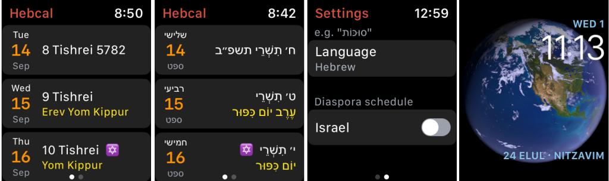

# Hebcal for Apple Watch

Hebcal Hebrew Calendar provides watch face complications with today’s Hebrew date and this week’s Torah portion. The watch app displays the next 60 days of Hebrew/Gregorian dates and upcoming Jewish holidays. No frills, no gimmicks, no notifications, just an easy way to glance at the date and parsha.

The Hebrew date and weekly Torah portion can be displayed as transliterations in Sephardic (e.g. “Shabbat” or “Sukkot”) or Ashkenazi (e.g. “Shabbos” or “Sukkos”) or in Hebrew (e.g. “שַׁבָּת” or “סוּכּוֹת”). Select Israel from the settings if you are based in Israel and want to see the Israeli Jewish holiday & Torah reading schedule. The default setting is for [Diaspora](https://www.hebcal.com/home/51/what-is-the-differerence-between-the-diaspora-and-israeli-sedra-schemes) (outside of Israel).

The app requires an iPhone with iOS 13.0 or later and an Apple Watch® with watchOS 7.0 or later. The app requires an iPhone to install, but there is no companion iPhone app. It runs only on the watch.

As of September 2021, there are two ways to get the watch app:

1. Sign up for [Hebcal Watch Beta](https://testflight.apple.com/join/Okxe2ONS) so we can collect your feedback and improve the app! The public beta installs via TestFlight, which will let you get early access to any new features

2. Install the released version of the app directly from the App Store:

Hebcal (pronounced HEEB-kal, as in **Heb**rew **cal**endar) provides Jewish calendar and holiday information. Our mission is to increase awareness of Jewish holidays and to help Jews to be observant of the _mitzvot_.
