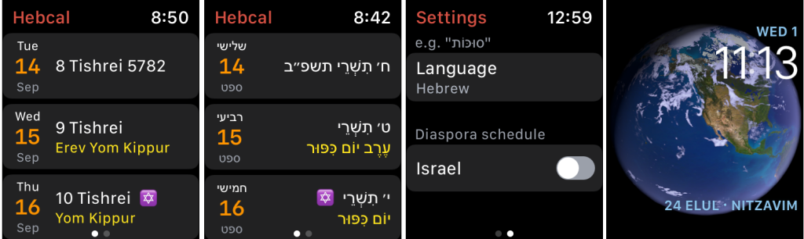

# Hebcal for Apple Watch

Hebcal Hebrew Calendar provides watch face complications with today’s Hebrew date and this week’s Torah portion. The watch app displays Hebrew/Gregorian dates for the next two weeks, followed by Shabbatot and Jewish holidays for the next four months. No frills, no gimmicks, no notifications, just an easy way to glance at the date and parsha.

The Hebrew date and weekly Torah portion can be displayed as transliterations in Sephardic (e.g. “Shabbat” or “Sukkot”) or Ashkenazi (e.g. “Shabbos” or “Sukkos”) or in Hebrew (e.g. “שַׁבָּת” or “סוּכּוֹת”). Select Israel from the settings if you are based in Israel and want to see the Israeli Jewish holiday & Torah reading schedule. The default setting is for [Diaspora](https://www.hebcal.com/home/51/what-is-the-differerence-between-the-diaspora-and-israeli-sedra-schemes) (outside of Israel).

Because Hebrew days begin at sundown, the app rolls over to the next Hebrew date after 8 PM local time. You can also turn on Daf Yomi in the settings to see the day’s page of Talmud.

## Complications

Three complications are available for your watch face:

* **Hebcal** (rectangular, inline) — Hebrew date, Torah portion, and holidays
* **Hebrew Date** (circular, corner, inline) — today’s date in the Hebrew calendar
* **Torah Portion** (circular, inline) — this week’s parsha, or today’s holiday

## Requirements

The app requires an Apple Watch® with watchOS 10.6 or later, paired with an iPhone. The app requires an iPhone to install, but there is no companion iPhone app. It runs only on the watch.

## Download

There are two ways to get the watch app:

1. Sign up for [Hebcal Watch Beta](https://testflight.apple.com/join/Okxe2ONS) so we can collect your feedback and improve the app! The public beta installs via TestFlight, which will let you get early access to any new features

2. Install the released version of the app directly from the App Store:

Hebcal (pronounced HEEB-kal, as in **Heb**rew **cal**endar) provides Jewish calendar and holiday information. Our mission is to increase awareness of Jewish holidays and to help Jews to be observant of the _mitzvot_.
